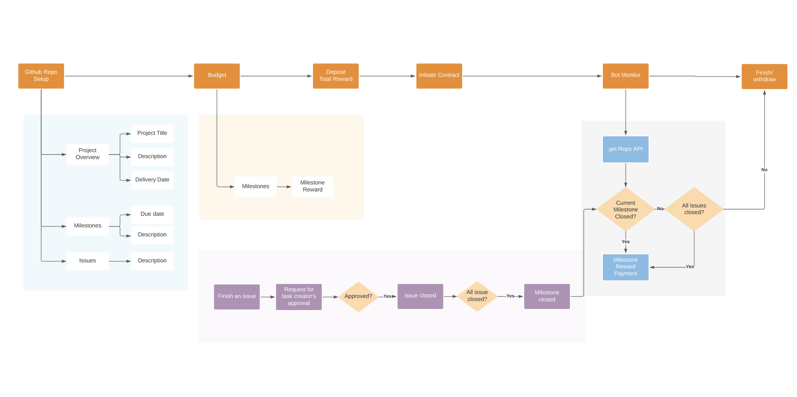

## Overview

#### **Project Description**

Atropos is a smart contract platform that bridges project starters with developers. Organizers and developers no longer need to sign cumbersome agreements. Bounties are funded by the organizers and **automatically paid out to developers when milestones are reached**. Through reducing legal and bureaucratic overhead, we aim to **empower and foster unprecedented collaboration between developers worldwide**.

#### **User Journey**

* Set up a Github Repository for the project with specified milestones
* Connect to Atropos
* Start a project
    * Input the Github Repository link
    * Set project delivery date
    * Set milestone reward and delivery date
    * Review and complete
* Manage project
    * Track project progress and trigger the auto reward when a milestone is closed

#### **User Flow**
 